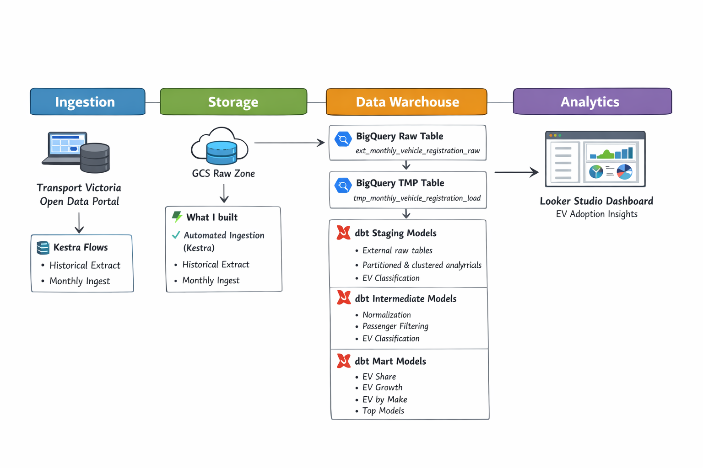
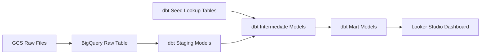
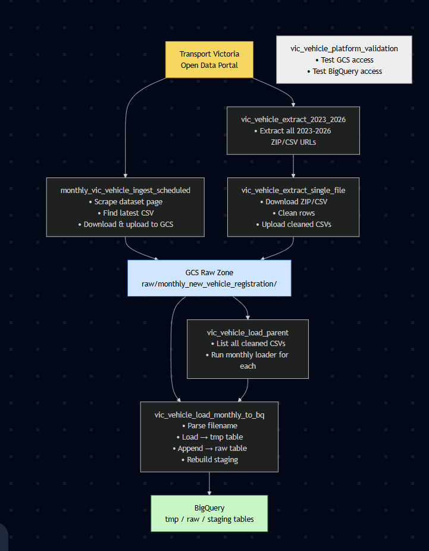
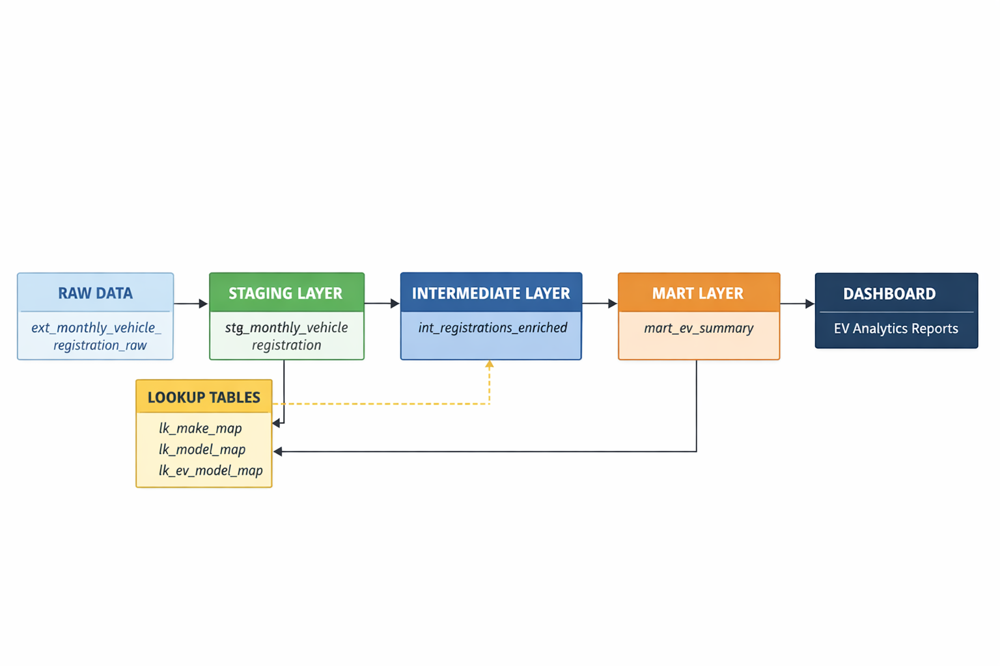
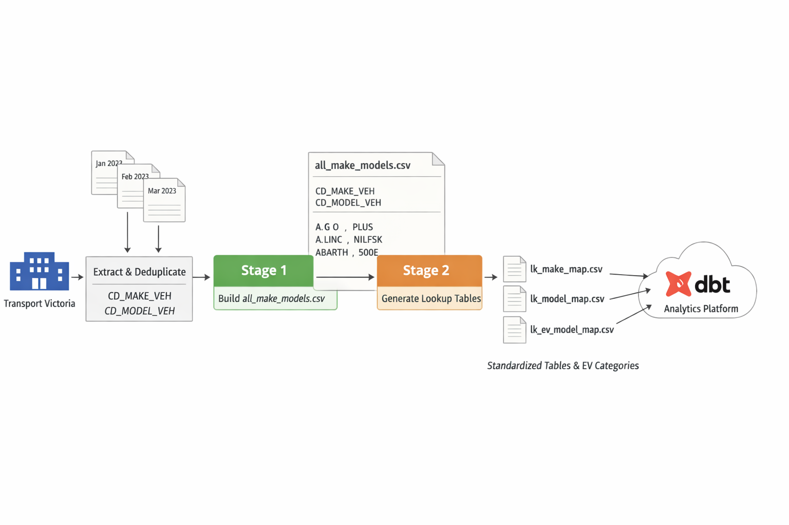
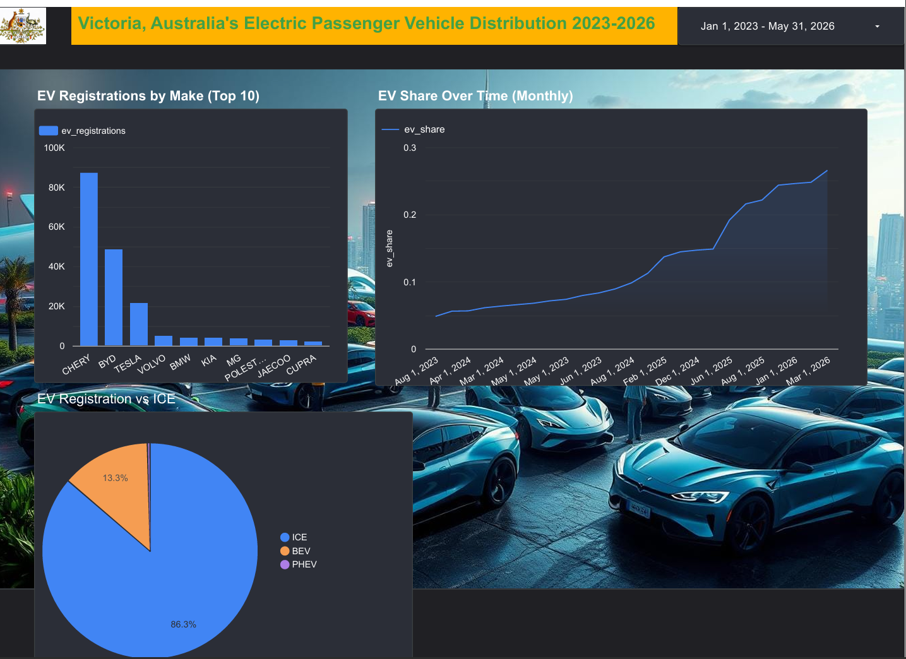

# **Victoria EV Registration Analytics**  
*A complete end‑to‑end data engineering pipeline for EV passenger cars adoption analytics in Victoria, Australia.*

---

# **1. Project Overview**

Victoria’s vehicle registration dataset contains hundreds of thousands of records, but the raw data is not directly usable for EV analytics. Make and model fields are inconsistent, fuel information is unreliable, and new EV brands appear frequently with messy naming conventions. This project builds a **fully reproducible cloud‑based data pipeline** that:

- ingests raw registration files from Transport Victoria,
- stores them in a structured data lake,
- cleans and standardizes vehicle make/model fields,
- classifies each vehicle into **BEV, PHEV, HEV, ICE**,  
- aggregates the data into analytical marts,
- and exposes the results in a Looker Studio dashboard.

The final output enables clear answers to questions such as:

- How many vehicles are electric?
- Which makes and models drive EV growth?
- How is EV share changing over time?
- What is the balance between BEV, PHEV, HEV, and ICE?

This project demonstrates a complete modern data engineering workflow using **GCS, BigQuery, Kestra, dbt, Terraform, and Looker Studio**.

---

# **2. Architecture**




## **2.1 High‑Level Architecture Diagram**








---

## **2.2 Architecture Explanation**

### **Raw Layer (GCS + BigQuery External Table)**
- Raw CSVs from Transport Victoria are ingested into a GCS bucket.
- BigQuery external tables expose the raw files without modification.

### **Staging Layer (dbt)**
- Cleans raw fields (make, model, body type, year, state).
- Standardizes casing, whitespace, and date formats.
- Produces a clean, typed staging table.

### **Lookup Layer (Python + dbt seeds)**
- A Python script generates:
  - `lk_make_map`
  - `lk_model_map`
  - `lk_ev_model_map`
- These lookup tables normalize messy make/model variants and classify EV categories.

### **Intermediate Layer (dbt)**
- Joins staging data with lookup tables.
- Filters to **passenger vehicles only**.
- Applies EV classification.
- Produces `int_registrations_enriched`.

### **Mart Layer (dbt)**
Final analytical tables:
- `mart_ev_share_by_month`
- `mart_ev_by_make`
- `mart_ev_growth_rate`
- `mart_top_models`

### **Dashboard Layer (Looker Studio)**
- Visualizes EV adoption trends.
- Provides categorical and temporal insights.

---

# **3. End‑to‑End Pipeline Flow**

## **3.1 Ingestion (Kestra)**

Kestra orchestrates the ingestion pipeline:

### **Historical Load**
- `vic_vehicle_extract_2023_2026.yml`  
  Extracts all historical CSV/ZIP files (2023–2026) and loads them into GCS.

### **Monthly Incremental Load**
- `monthly_vic_vehicle_ingest_scheduled`  
  Scrapes the Transport Victoria dataset page, finds the latest file, downloads it, and uploads it to GCS.

### **Load to BigQuery**
- `vic_vehicle_load_monthly_to_bq`  
  Loads raw CSV → tmp table → raw table → rebuilds staging.

### **Validation**
- `vic_vehicle_platform_validation.yml`  
  Confirms GCS and BigQuery access.

---

## **3.2 Lookup Table Generation (Python)**

A Python script consolidates all raw make/model pairs and applies:

- whitespace normalization  
- OCR error correction  
- variant collapsing  
- EV classification rules  
- passenger‑vehicle filtering  

Outputs three lookup tables stored in `dbt/seeds/`.

---

## **3.3 Transformations (dbt)**

### **Staging**
- Clean raw fields  
- Standardize naming  
- Derive registration month  

### **Intermediate**
- Normalize make/model  
- Filter to passenger vehicles  
- Join EV classification  
- Produce enriched records  

### **Marts**
- EV share by month  
- EV growth rate  
- EV counts by make  
- Top EV models  

---

## **3.4 Dashboard (Looker Studio)**

The dashboard answers:

- How many vehicles are EVs?
- How is EV share trending monthly?
- Which makes dominate EV registrations?
- Which models are most common?

---

# **4. Reproduction Steps**

## **4.1 Clone the Repository**
```bash
git clone <your-repo-url>
cd <your-repo-folder>
```

## **4.2 Set Environment Variables**

## Configure the GCP Service Account for Kestra (if secrets management fails)
PS: Configure GCP keys as you normally would as the below steps are for my reference. 

1. Store the Google Cloud service account JSON key inside the workspace.
2. Mount the key file into the container or pass it into the Python task container.
3. Set `GOOGLE_APPLICATION_CREDENTIALS` to the mounted key path when needed.
4. Avoid Kestra secrets if they are unavailable in the Community Edition.
5. Add the key folder to `.gitignore`.
6. Verify that the Kestra flow can access GCS and BigQuery.


```bash
export GCP_PROJECT_ID=your-project-id
export BQ_DATASET=vic_vehicle_analytics
export GCS_BUCKET=your-bucket-name
```

## **4.3 Provision Infrastructure (Terraform)**
```bash
cd terraform
terraform init
terraform plan
terraform apply
```

Creates:
- GCS bucket  
- BigQuery dataset  

## **4.4 Start Kestra**
Run Kestra with GCP credentials mounted:

```bash
docker run --pull=always --rm -it \
  -p 8080:8080 \
  --user=root \
  -v /var/run/docker.sock:/var/run/docker.sock \
  -v /tmp:/tmp \
  -v $(pwd)/flows:/app/flows \
  -v <path-to-your-sa-key>/service-account.json:/app/service-account.json \
   -e GOOGLE_APPLICATION_CREDENTIALS=/app/service-account.json \
  kestra/kestra:latest server local
```

## **4.5 Run Kestra Flows**
1. Historical load  
2. Parent load  
3. Optional: validation flow  

Run the following flows in Kestra ( Extraction and Load)
1. ```javascript vic_vehicle_extract_2023_2026.yml ``` flow which loads all data from 2023 to current months ( March 2026)
   This loads all data into GCS buckets (Data Lake) we created using terraform
2. ```javascript vic_vehicle_load_parent.yml ``` flow which loads all data from GCS to BigQuery(Date Warehouse )
Optional - vic_vehicle_platform_validation.yml run to check GCS and BQ access is sorted. 

## **4.6 Generate Lookup Tables**

We generate the source csv for make and models from staging table created by Kestra.
```bash
SELECT DISTINCT
  CD_MAKE_VEH,
  CD_MODEL_VEH
FROM vic_vehicle_analytics.stg_monthly_vehicle_registration
WHERE CD_MAKE_VEH IS NOT NULL
  AND CD_MODEL_VEH IS NOT NULL
ORDER BY CD_MAKE_VEH asc;
```

```bash
python scripts/latest/generate_lookup_tables.py
```

## **4.7 Load Lookup Tables**
```bash
cd dbt
dbt seed --full-refresh
```

## **4.8 Build the Full Pipeline**
```bash
dbt build
```

## **4.9 Open the Dashboard**
Connect Looker Studio to the mart tables.

---

# **5. Data Modeling Layers**

## **5.1 Staging Models**
- Clean raw fields  
- Standardize make/model casing  
- Derive registration month  
- Remove invalid rows  

## **5.2 Intermediate Models**
- Normalize make/model using lookup tables  
- Filter to passenger vehicles  
- Join EV classification  
- Produce enriched dataset  

## **5.3 Mart Models**
- **mart_ev_share_by_month**  
  EV share, BEV share, PHEV share  
- **mart_ev_by_make**  
  EV counts by manufacturer  
- **mart_ev_growth_rate**  
  Month‑over‑month growth  
- **mart_top_models**  
  Most common EV models  

---

# **6. Dashboard**

The dashboard includes:

### **Categorical Chart**
- EV registrations by make (Top 10)

### **Temporal Chart**
- EV share over time (combo chart: EV, BEV, PHEV)

### **Additional Charts**
- EV vs ICE donut  
- Top EV models  
- EV growth rate  


Dashboard link:  
**`https://datastudio.google.com/embed/reporting/ea683482-b128-493c-abe2-bdcc0e526020/page/mgkvF`](https://www.bing.com/search?q="https%3A%2F%2Fdatastudio.google.com%2Fembed%2Freporting%2Fea683482-b128-493c-abe2-bdcc0e526020%2Fpage%2FmgkvF")**

---

# **7. Challenges & Solutions**

## **7.1 Messy Make/Model Data**
Raw data contains:
- OCR errors  
- spacing inconsistencies  
- abbreviations  
- partial names  
- corrupted strings  

**Solution:**  
A Python normalization pipeline that collapses variants and produces clean lookup tables.

---

## **7.2 EV Misclassification**
Example:  
Ford Everest variants (`EVERAS`, `EVRRES`, etc.) were incorrectly tagged as BEV due to “EV” prefix.

**Solution:**  
Brand‑specific override rules + model collapsing logic.

---

## **7.3 Missing EV Share in Marts**
`ev_share` was not initially included.

**Solution:**  
Added:
```sql
safe_divide(bev_count + phev_count + hev_count, total_registrations) as ev_share
```

---

## **7.4 Looker Studio “New Field” Bug**
Caused by missing or mis‑typed metrics.

**Solution:**  
Refresh schema + set field type to Percent.

---

## **7.5 Passenger Vehicle Filtering**
Raw data includes:
- trucks  
- buses  
- trailers  
- commercial vehicles  

**Solution:**  
Passenger‑only intermediate model using `lk_make_map`.

---

## **7.6 Lookup Table Generation Complexity**
Needed to unify:
- make normalization  
- model normalization  
- EV classification  

**Solution:**  
A single deterministic Python pipeline.

---

# **8. Future Improvements**
- Add anomaly detection for sudden spikes  
- Add CI for dbt tests  
- Add partitioning/clustering optimizations  
- Expand classification for rare models  
- Add dashboard filters (make, model, body type)  

---

# **9. Repository Structure**

```bash
.
├── README.md
├── terraform/
├── ingestion/
│   ├── scripts/
│   └── flows/
├── dbt/
│   ├── models/
│   ├── seeds/
│   ├── macros/
│   └── tests/
├── scripts/
│   └── latest/generate_lookup_tables.py
└── dashboard/
```

---

# **10. Key Learnings**

This project demonstrates:

- How to build a cloud‑native data pipeline  
- How to clean and normalize messy real‑world data  
- How to design dbt models across staging → intermediate → marts  
- How to classify EVs using lookup logic  
- How to build reproducible analytics workflows  
- How to create a dashboard that tells a clear story  

---

# **11. Project Status**

The project is fully reproducible, end‑to‑end automated, and ready for peer review.

---
