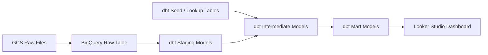
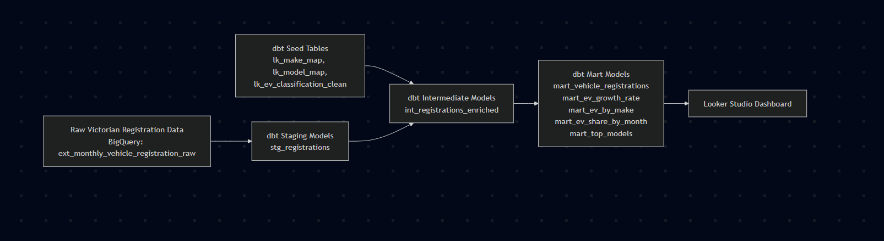

# vic-ev-analytics
## Problem Description

Victoria’s vehicle registration data contains a large and growing number of vehicles, but the raw records are not immediately useful for understanding the shift to electric mobility. The main challenge is that the data is stored in low-level registration fields such as make, model, body type, and fuel-related text, which makes it difficult to reliably identify whether a vehicle is an EV, PHEV, HEV, or traditional ICE vehicle.

This project solves that problem by transforming raw registration data into a clean analytical model that can classify vehicles by powertrain type and support EV adoption analysis over time. Without this transformation, it is hard to answer basic questions such as: How many registered vehicles are electric? Which makes and models are driving EV growth? Is EV adoption increasing month by month? By building lookup tables, staging models, and a final mart, the project turns messy registration data into a reliable dataset for EV market analysis.

The goal is to create a reproducible pipeline that can be used to monitor vehicle registrations, compare EVs against non-EVs, and track adoption trends in a way that is transparent and easy to update. This makes the data useful not just for reporting, but for understanding the real pace of transition in Victoria’s vehicle fleet

# Victoria EV Registration Analytics

## Project Overview

This project analyzes Victorian vehicle registration data to understand the transition from traditional internal combustion vehicles to electric vehicles. The raw registration records are messy and inconsistent, so the project builds a reproducible data pipeline that cleans the source data, standardizes vehicle makes and models, classifies vehicles by powertrain type, and exposes the final analytics tables in BigQuery for dashboarding in Looker Studio.

## Problem Description

Victoria’s vehicle registration data is rich, but raw make and model fields are not enough to reliably identify EVs, PHEVs, HEVs, and ICE vehicles. Different spelling variants, abbreviations, and inconsistent naming make direct analysis difficult. This project solves that problem by transforming raw registration records into a clean analytical model that can support EV adoption analysis, model-level comparisons, and time-based reporting.

Without this transformation, it is hard to answer questions such as:
- How many vehicles are electric?
- Which makes and models are driving EV growth?
- How is EV share changing over time?
- What is the balance between EV, PHEV, HEV, and ICE registrations?

## Objectives

- Clean and standardize raw vehicle registration data.
- Build lookup tables for make, model, and EV classification.
- Classify vehicles into EV, PHEV, HEV, ICE, or UNKNOWN.
- Create reusable BigQuery tables for analytics.
- Build a dashboard in Looker Studio to visualize EV adoption trends.

## Data Sources

The project uses:
- Raw Victorian vehicle registration data stored in BigQuery.
- Lookup tables for standardized makes and models.
- EV classification tables derived from curated model rules and lookup mappings.

## Architecture

The pipeline follows a simple layered architecture:
1. Raw registration data is loaded into BigQuery.
2. dbt seeds load lookup and classification tables.
3. dbt staging models clean and standardize the raw data.
4. dbt intermediate models join the raw data to lookup tables and derive powertrain classification.
5. dbt marts create final analytical tables.
6. Looker Studio reads from BigQuery to build charts and dashboards.

---

## Use the Tech Stack

Use the following tools in this project:
- **Google Cloud Storage** to store raw files
- **BigQuery** to store and query warehouse tables3
- **Kestra** orchestrator to ingest and store CSV files
- **dbt** to transform raw data into analytical models
- **Terraform** to provision cloud infrastructure
- **Looker Studio** to build the dashboard
- **GitHub** to version and share the project


## Data Analytics Pipeline Design

### Staging Layer
The staging layer standardizes raw registration fields such as make, model, body type, state, year, and fuel type.

### Intermediate Layer
The intermediate layer joins the registration data to lookup tables and applies classification logic to derive the vehicle category.

### Mart Layer
The mart layer aggregates the cleaned data into business-ready tables for analysis and visualization.

## Key Outputs

The final project includes:
- Cleaned and standardized vehicle registration tables.
- EV classification lookup tables.
- Aggregated analytical marts.
- Looker Studio charts for EV adoption trends.

## Dashboard Questions
[text](https://datastudio.google.com/embed/reporting/ea683482-b128-493c-abe2-bdcc0e526020/page/mgkvF)
The dashboard is designed to answer:
- What is the total number of registrations?
- How many are EVs?
- Which makes have the highest EV counts?
- How is EV share changing by month?
- Which models are most common?

## Reproducibility

Follow this data flow:
1. Store raw files in GCS.
2. Load raw files into BigQuery.
3. Clean and standardize source data in dbt staging models.
4. Join lookup tables and derive analytical fields in dbt intermediate models.
5. Build reporting tables in dbt marts.
6. Connect Looker Studio to the final mart tables.


### Understand the Project

Use this project to transform raw Victorian vehicle registration data into analytics-ready tables for EV adoption reporting.

Use the pipeline to:
- ingest raw files into GCS,
- load source data into BigQuery,
- transform the data with dbt,
- and visualize the final outputs in Looker Studio.

Solve the core problem that raw registration data does not clearly identify EVs, PHEVs, HEVs, and ICE vehicles in a clean and analysis-friendly format.

---

### Understand the Problem

Raw vehicle registration records contain useful information, but do not directly support EV analytics. Expect inconsistencies in make names, model names, and other descriptive fields.

Use this project to:
- clean raw registration records,
- standardize important columns,
- apply lookup-based classification logic,
- and create reporting tables for EV adoption analysis.

Use the final outputs to answer questions such as:
- How many registered vehicles are EVs?
- How is EV share changing over time?
- Which manufacturers contribute most to EV growth?
- Which vehicle models appear most often?


### Step 1 Initial Setup/ Requirements
- To start off you will need a GCP account as most of the resources are there. 
- The project was developed in GitHub codespaces which has most of the required packages and utils available like Python 3.12.1 
- GCP service account with following permission BigQuery Data Editor, BigQuery Job User, Storage Object Admin
- GCP JSON key ready

#### 1. Clone the Repository

```bash
git clone <your-repo-url>
cd <your-repo-folder>
```

#### 2. Configure Environment Variables

Set environment variables instead of hardcoding local paths or personal cloud values.

Example:

```bash
export GCP_PROJECT_ID=your-project-id
export BQ_DATASET=vic_vehicle_analytics
export GCS_BUCKET=your-bucket-name
```

#### 3. Install dbt Dependencies

Open the dbt project folder and install required packages.

```bash
cd dbt
dbt deps
```


#### 1. Provision Infrastructure

Create the cloud infrastructure before loading any data.

1. Open the Terraform directory.

   ```bash
   cd terraform
   ```

2. Initialize Terraform.

   ```bash
   terraform init
   ```

3. Review the execution plan.

   ```bash
   terraform plan
   ```

4. Apply the infrastructure.

   ```bash
   terraform apply
   ```

5. Type `yes` when prompted.

6. Verify that Terraform creates:
   - the GCS bucket for raw data storage,
   - and the BigQuery dataset for warehouse tables.

#### 2. Load Raw Data into GCS

Upload or ingest the raw vehicle registration files into the GCS bucket.

Use GCS as the raw storage layer for the project.

#### 3. Load Raw Data into BigQuery

Load the source files from GCS into a raw BigQuery table.

Use the raw BigQuery table as the source layer for dbt models.


### Step 2 Start Kestra
I had issues with Docker compose and GCP key so I started a standalone docker container with GCP key mapped
Run Kestra with GCP Credentials
Start Kestra in a Docker container and mount the Google Cloud service account key so Kestra can authenticate to GCP.


```markdown
docker run --pull=always --rm -it \
  -p 8080:8080 \
  --user=root \
  -v /var/run/docker.sock:/var/run/docker.sock \
  -v /tmp:/tmp \
  -v $(pwd)/flows:/app/flows \
  -v $(pwd)/gcp/service-account.json:/app/service-account.json \
  -e GOOGLE_APPLICATION_CREDENTIALS=/app/service-account.json \
  kestra/kestra:latest server local
 
``` 
Why This Setup Is Needed?
Use GOOGLE_APPLICATION_CREDENTIALS so Kestra and the Google client libraries can find the service account JSON file inside the container.

Mount $(pwd)/gcp/service-account.json into the container so the credentials file is available at /app/service-account.json.

Use the mounted file to let Kestra access Google Cloud services such as GCS and BigQuery with the correct permissions.

How It Works
Mount the service account JSON file into the container.

Point GOOGLE_APPLICATION_CREDENTIALS to that file path.

Let Kestra use the credentials when it runs Google Cloud tasks.

What This Enables
Use this setup so Kestra can:

read files from GCS.

load data into BigQuery.

run Google Cloud tasks with proper authentication.

Important Note
Keep the service account JSON file out of Git and out of your Docker image.

Store the file locally or in a managed secret system, and mount it only when you run Kestra.


### Step 3 - Run Kestra Flow
flowchart TD

    %% ============================
    %%   DATA SOURCE
    %% ============================
    A[Transport Victoria<br>Open Data Portal]:::source

    %% ============================
    %%   SCHEDULED MONTHLY INGEST
    %% ============================
    A --> B[monthly_vic_vehicle_ingest_scheduled<br>• Scrape dataset page<br>• Find latest CSV<br>• Download & upload to GCS]

    B --> C[GCS Raw Zone<br>raw/monthly_new_vehicle_registration/]:::storage

    %% ============================
    %%   MONTHLY LOAD PIPELINE
    %% ============================
    C --> D[vic_vehicle_load_monthly_to_bq<br>• Parse filename<br>• Load → tmp table<br>• Append → raw table<br>• Rebuild staging]

    D --> E[BigQuery<br>tmp / raw / staging tables]:::bq


    %% ============================
    %%   HISTORICAL EXTRACTION
    %% ============================
    A --> F[vic_vehicle_extract_2023_2026<br>• Extract all 2023–2026 ZIP/CSV URLs]

    F --> G[vic_vehicle_extract_single_file<br>• Download ZIP/CSV<br>• Clean rows<br>• Upload cleaned CSVs]

    G --> C


    %% ============================
    %%   BULK LOAD (PARENT)
    %% ============================
    C --> H[vic_vehicle_load_parent<br>• List all cleaned CSVs<br>• Run monthly loader for each]

    H --> D


    %% ============================
    %%   PLATFORM VALIDATION
    %% ============================
    I[vic_vehicle_platform_validation<br>• Test GCS access<br>• Test BigQuery access]:::utility


    %% ============================
    %%   STYLES
    %% ============================
    classDef source fill:#f6d860,stroke:#b8860b,stroke-width:1px,color:#000;
    classDef storage fill:#d0e6ff,stroke:#1e64c8,stroke-width:1px,color:#000;
    classDef bq fill:#c8f7c5,stroke:#2e8b57,stroke-width:1px,color:#000;
    classDef utility fill:#eee,stroke:#999,stroke-width:1px,color:#000;


Run the following flows in Kestra ( Extraction and Load)
1. ```javascript vic_vehicle_extract_2023_2026.yml ``` flow which loads all data from 2023 to current months ( March 2026)
   This loads all data into GCS buckets (Data Lake) we created using terraform
2. ```javascript vic_vehicle_load_parent.yml ``` flow which loads all data from GCS to BigQuery(Date Warehouse )

Optional
vic_vehicle_platform_validation.yml run to check GCS and BQ access is sorted. 


Two tables are create from Kestra's EL pipeline
1. ext_monthly_vehicle_registration_raw
2. tmp_monthly_vehicle_registration_load

These two tables are created as part of the monthly vehicle ingestion pipeline. First, the raw CSV is landed in the GCS raw zone and exposed through **ext_monthly_vehicle_registration_raw**, which provides direct access to the source file without modifying its contents. Then the data is loaded into **tmp_monthly_vehicle_registration_load**, a temporary staging table used to clean, validate, and prepare the records before they are passed into the final monthly load process. Together, they separate source access from transformation work and make the pipeline easier to debug, rerun, and maintain.

**tmp_monthly_vehicle_registration_load** is a temporary staging table created from the raw monthly vehicle registration source and contains only the core fields needed for downstream processing, such as make, model, body type, year, and total counts. Unlike the external raw table, which exposes the full source file, this table is a simplified subset used to prepare the data for the final monthly load into BigQuery. This separation keeps the pipeline lean, easier to validate, and easier to maintain.

This workflow uses three tables to separate loading, raw storage, and analytics preparation. First, the CSV is loaded into **tmp_monthly_vehicle_registration_load**, a temporary table that contains only the core source columns needed for ingestion. Next, the data is appended into **ext_monthly_vehicle_registration_raw**, which stores the monthly records together with file metadata such as source file, month, year, registration month, and load timestamp. Finally, **stg_monthly_vehicle_registration** is rebuilt from the raw table into a cleaner analytics-ready shape with renamed and derived fields for downstream modeling and reporting.

### Step 4- Prepare Lookup Tables
**How the all_make_models.csv file is created**
Before lookup tables can be generated, the project builds a consolidated all_make_models.csv file that contains every unique make/model pair observed across the Victorian registration dataset. This file is produced by extracting the raw CD_MAKE_VEH and CD_MODEL_VEH fields from all monthly registration extracts, normalising whitespace and casing, and then deduplicating the results. The goal is to create a single authoritative list of every make and model that appears in the source data, including rare variants, OCR‑damaged entries, and new EV brands entering the market. This unified list becomes the input to the Stage‑2 lookup generator, ensuring that every possible raw value is normalised, classified, and mapped consistently before dbt models consume it.

To support clean, reliable analytics, the project includes a Stage‑2 lookup generation step that standardises all raw make/model strings from the Victorian registration dataset. Transport Victoria’s source files contain inconsistent spacing, OCR errors, hyphen variations, and multiple spelling variants for the same vehicle. The Stage‑2 script consolidates three previously separate processes—make normalisation, model normalisation, and EV classification—into a single deterministic pipeline. It reads the raw CD_MAKE_VEH and CD_MODEL_VEH fields, applies intelligent cleaning and variant‑collapsing rules, filters to passenger‑car brands, and assigns each model an EV category (BEV/PHEV/HEV/ICE). The output is a set of three lookup tables (lk_make_map, lk_model_map, lk_ev_model_map) stored in seeds_stage2/, which are then used by dbt to ensure consistent joins, accurate EV classification, and reproducible downstream analytics.

Special CSVs from three lookup tables were created to reduce data noise on Make Model and EV catehory fields. Loads these csv as table in Biq query by running 

The seeds files are already loaded in **dbt/seeds** folder

```markdown
dbt seed
```


### Step 5- DBT runs - Transform the Data with dbt

Use dbt to clean, standardize, enrich, and model the raw registration data.

Create:
- staging models for cleaned source fields,
- intermediate models for enrichment and classification,
- and mart models for reporting.


#### Load seeds into BigQuery
bash
cd dbt
dbt seed --full-refresh
#### Run the full dbt pipeline
bash
dbt build


australia-ev-analytics/
│
├── scripts/
│   └── latest/generate_lookup_tables.py
│
├── dbt/
│   ├── models/
│   │   ├── staging/
│   │   ├── intermediate/
│   │   └── marts/
│   ├── seeds/
│   └── target/
│
└── data/


---


### 4. Run dbt Models

Run all dbt models.

```bash
dbt run
```

### 5. Run dbt Tests

Run data quality checks.

```bash
dbt test
```

### 6. Open the Dashboard

Connect Looker Studio to the final BigQuery mart tables and build the reporting layer.

### Step 6 - Looker Studio - Build the Dashboard

Connect Looker Studio to the final BigQuery mart tables.

Use the dashboard to visualize EV adoption trends and category-level insights.


## Review the Architecture



---

## Use the dbt Layers

### Use the staging layer
Clean and normalize the raw source fields.

Standardize columns such as:
- registration date,
- make,
- model,
- body type,
- and state.

### Use the intermediate layer
Join lookup tables and derive normalized analytical fields.

Use this layer to enrich records and apply EV classification logic.

### Use the mart layer
Create reporting-ready tables for analysis and dashboarding.

Use mart models to produce:
- EV growth over time,
- EV share by month,
- EV counts by make,
- and top vehicle models.

---

## Review the Main Models

Use model groups such as:
- `stg_registrations`
- `int_registrations_enriched`
- `int_normalized_make_model`
- `mart_ev_growth_rate`
- `mart_ev_share_by_month`
- `mart_ev_by_make`
- `mart_top_models`

---

## Review the Repository Structure

```bash
.
├── README.md
├── terraform/
│   ├── main.tf
│   ├── variables.tf
│   └── outputs.tf
├── ingestion/
│   ├── scripts/
│   └── flows/
├── dbt/
│   ├── dbt_project.yml
│   ├── models/
│   │   ├── staging/
│   │   ├── intermediate/
│   │   └── marts/
│   ├── seeds/
│   ├── macros/
│   └── tests/
└── dashboard/
```

Update the structure above if your real folder names differ.

---

## Check Data Quality

Run dbt tests on key fields before using the final marts.

Validate:
- unique identifiers,
- not-null business-critical columns,
- and accepted values where needed.

Use these tests to catch model and source issues early.

---

## Use the Dashboard Outputs

Use the final dashboard to answer questions such as:
- How many vehicles are EVs?
- How is EV adoption changing month by month?
- Which manufacturers have the highest EV counts?
- Which models dominate the EV segment?

---

## Handle Reproducibility Correctly

Follow these rules before submitting the repo:

1. Commit every required file to the repository.
2. Avoid hardcoding local file paths.
3. Avoid hardcoding personal GCP project IDs when environment variables can be used.
4. Ignore generated dbt artifacts such as `dbt/target/`.
5. Run `dbt deps` if the project depends on external dbt packages.
6. Test the project from a clean clone.
7. Make sure the README matches the actual codebase.
8. Verify that setup commands run without missing files or broken paths.

---

## Note the Limitations

Expect some vehicle records to remain difficult to classify because raw registration data may not always contain clean or complete fuel or drivetrain details.

Use lookup-based logic to improve classification, but expect some edge cases to require future refinement.

---

## Plan Future Improvements

Improve the project further by:
- expanding classification coverage for rare models,
- adding freshness and anomaly checks,
- optimizing BigQuery partitioning and clustering,
- adding more dashboard filters,
- and automating validation in CI.

---

## Credit the Project

Use this repository as a portfolio data engineering project focused on EV adoption analytics in Victoria, Australia.


### DBT Setup
To reproduce the project:
1. Load seed tables into dbt.
2. Run dbt staging models.
3. Run dbt intermediate and mart models.
4. Run dbt tests.
5. Connect Looker Studio to the final BigQuery mart tables.

## Challenges

Some vehicle records are difficult to classify because raw registration data does not always cleanly expose fuel or drivetrain information. This project addresses that limitation by introducing lookup-based normalization and classification logic, though some edge cases may still require refinement.

---

## Future Improvements

- Improve vehicle classification coverage for rare models.
- Add automated freshness and anomaly checks.
- Add partitioning and clustering optimizations in BigQuery.
- Expand dashboard filtering by make, model, and body type.
- Add CI checks for dbt tests and repository validation.

---

## Key Learnings

This project demonstrates how cloud storage, data warehousing, transformation tooling, and BI reporting fit together in an end-to-end analytics workflow. It also highlights the importance of reproducibility, clean modeling, data quality checks, and documentation in real-world data engineering projects.

## Project Status

This project is structured for reproducibility and analysis, with a clean pipeline from raw data to dashboard-ready marts.

